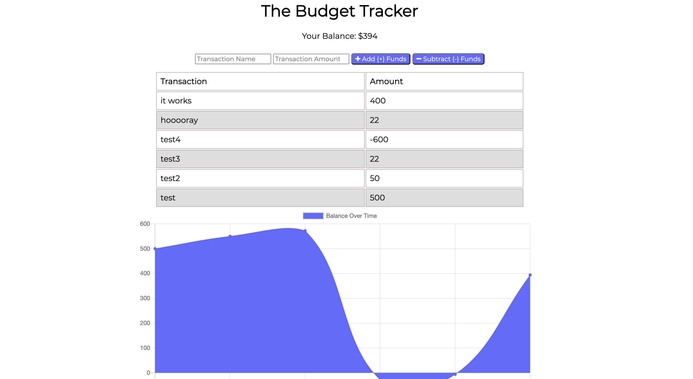

# Budget Tracker 💸

This is a budget tracker application that allows offline access and functionality. A user will be able to add expenses and deposits to their budget with or without a connection. If the user enters transactions offline, changes should be updated when they're brought back online.

#### Project Visuals :sunglasses:

## Link
[Click here](https://budget-tracker-full-stack.herokuapp.com/) to go to the deployed application.

### Built With 🧰
- MongoDB
- Express
- Mongoose

### User Story 📖
> AS AN avid traveler       
> I WANT to be able to track my withdrawals and deposits with or without a data/internet connection       
> SO THAT my account balance is accurate when I am traveling        

### Acceptance Criteria ✅
> GIVEN a budget tracker without an internet connection       
> WHEN the user inputs an expense or deposit       
> THEN they will receive a notification that they have added an expense or deposit       
> WHEN the user reestablishes an internet connection       
> THEN the deposits or expenses added while they were offline are added to their transaction history and their totals are updated

### Acknowledgements & Resources 🤝
- [Google Web Dev Docs](https://developers.google.com/web/ilt/pwa/introduction-to-service-worker)
- [Heroku Docs](https://devcenter.heroku.com/articles/git)
- [Mongo Docs](https://docs.atlas.mongodb.com/tutorial/create-new-cluster/)
